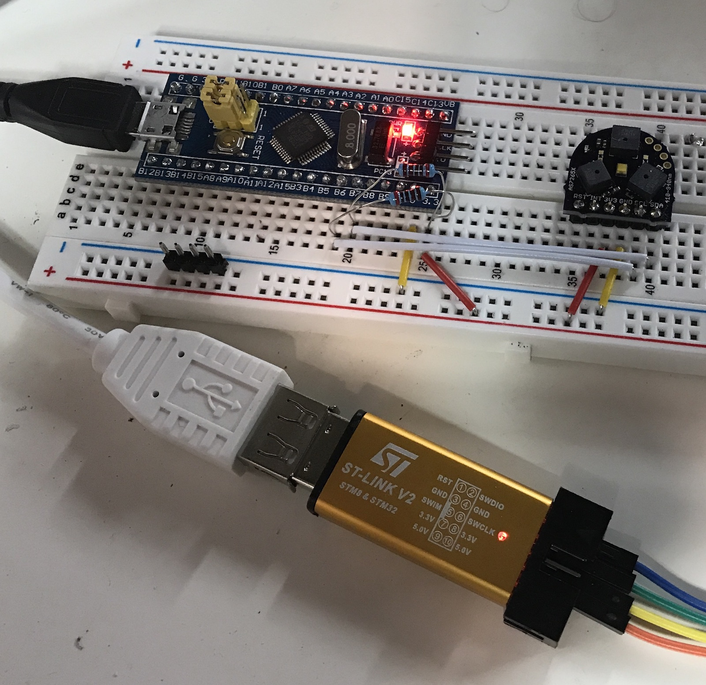
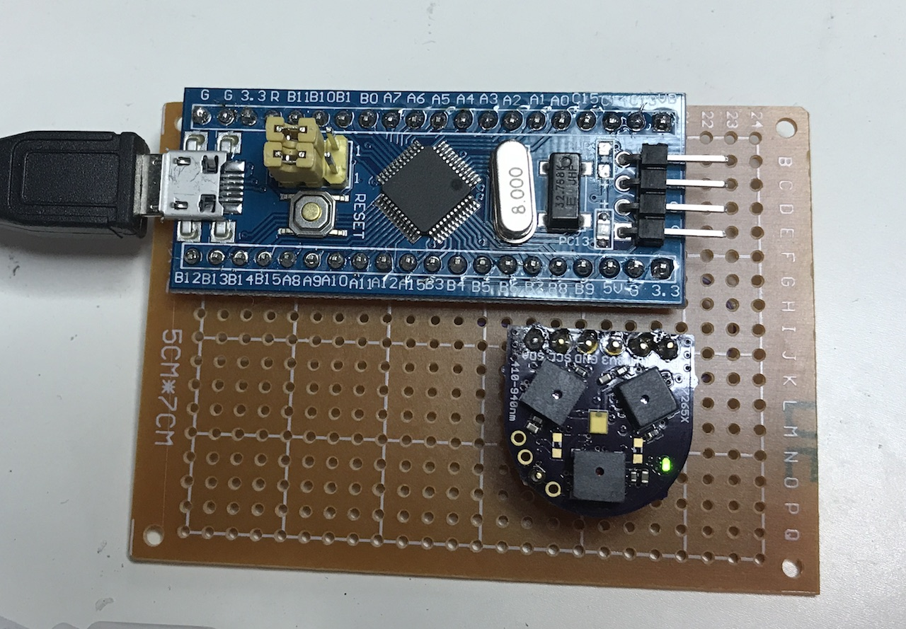

**This is very much work in progress! Don't expect anything to simply work out of the box!**

# Description

This project explores the possibilities of the AMS AS7265x set of 3 sensors and compares how it performs
against a true spectroradiometer.


The overall setup is extremely simple:

* [Compact AS7265X Spectrometer](https://www.tindie.com/products/onehorse/compact-as7265x-spectrometer/) from Tindie.
* [STM32 Blue Pill](https://wiki.stm32duino.com/index.php?title=Blue_Pill)

    The well known dirt cheap (less than $2) controller which has a USB device interface and an I2C master (among many other things.)

* [STM32 I2C Star](https://github.com/daniel-thompson/i2c-star) firmware

    This firmware implements a USB to I2C bridge. There is a Linux driver that supports this bridge
    that comes standard with the Linux kernel.

    After compiling, I flashed the firmware with an STLINK dongle.


The first prototype looks like this:



No schematic, but it's essentially power (3.3V), ground, and I2C wires connected between the Blue Pill and the sensor module, as 2 4.7K pullup
resistors on the I2C wires.

Here's everything soldered together:



# First Contact Testing

To test that the basics are working:

* install the `i2c-tools` package on your Ubuntu installation.

```
sudo apt install i2c-tools
```

* plug in the USB cable
* `i2cdetect -l`

    This will list all the I2C masters on your Linux machine, including the master that runs on your
    ST32 board. It will show up as `i2c-tiny-usb` (because i2c-star is an STM32 clone of the i2c-tiny-usb
    project on an AVR microcontroller.)

    It will also show `bus <nr>`.

* `sudo i2cdetect -y <nr>`

    This will can all the I2C slaves on the specified I2C bus. You should see a slave at address 0x49: that's
    the I2C address of the sensor. You're good to go!

# Use `as7265x` Tool

There is tool in the `./src` that I use to extract data from the sensor. It's under heavy development...

* Install I2C development libraries

```
sudo apt install libi2c-dev
```

* Compile `make` in the root directory.

The current command line options are [here](https://github.com/tomverbeure/spectroradiometer/blob/9a67c508d6ee08024441081776389e9e6c86e1fb/src/main.c#L113-L121).
Note that the `--server` and `--port` options are currently non-functional!

Current expected usage:

`sudo ./as7265x -i <nr> -d "My LCD screen"`

Once running, press 'r', 'g', 'b', or 'w' to record the sensor values when you're displaying a red, green, blue, or white image on the screen. (Images
can be found in the `./assets` directory.)

Press 'q' to quit.

A .csv file will be saved to disk.

That's it for now.

# Various information:

* AMS TCS34725 Color Sensor

    * [Datasheet](https://ams.com/tcs34725)
    * [Adafruit library](https://github.com/adafruit/Adafruit_TCS34725)

* AMS AS7265x Spectral Sensor

    * [Datasheet](https://ams.com/as7265x)


General color info

* [Taos Colorimetry Tutorial](https://ams.com/documents/20143/36005/LightSensors_AN000519_1-00.pdf/fb874ce7-0c27-0f38-0582-9cd564d38fdd)
